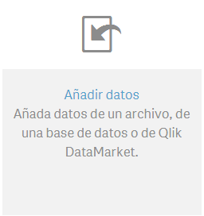
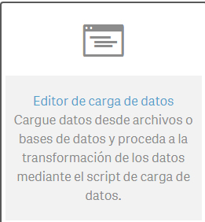

# Use Qlik with Apache Kylin

**Date:** September 2016

**Author:** Ramón Portolés, Alberto    [Linkedin](https://www.linkedin.com/in/alberto-ramon-portoles-a02b523b "My Linkedin") 

&nbsp;
&nbsp;
### Intro
It’s a new player in the BI tools world, with a high growth from 2013

[On-line demos](http://eu-a.demo.qlik.com/)

Nowadays has connectors for Hadoop Databases: [Hive](https://hive.apache.org/index.html) and [Impala](http://impala.apache.org/)

But doesn’t have Kylin connector

&nbsp;
&nbsp;

### Used Software:
* [Apache Kylin](http://kylin.apache.org/) v1.5.2
* [Kylin ODBC](http://kylin.apache.org/docs15/tutorial/odbc.html "Download")  v1.5
* [Qlik Descktop](http://www.qlik.com/us/try-or-buy/download-qlikview) v3.0.2.0

&nbsp;
&nbsp;

### Pre-requisites
A. We need an instance of Kylin, with a cube: [Quick Start with Sample Cube](http://kylin.apache.org/docs15/tutorial/kylin_sample.html), will be enough
	You can check: 

  

B. Download Install and configure Kylin ODBC Driver
  1. [Install Kylin ODBC](http://kylin.apache.org/docs15/tutorial/odbc.html)
  2. Add DNS System in Windows

  

  3. And configure: User-name /Password: ADMIN / KYLIN

  

  4. Click Connect and Choose the project

  

&nbsp;&nbsp;&nbsp;Click on “Done”
&nbsp;
&nbsp;

## Install Qlik:
Requires: [(System Requeriments)](https://help.qlik.com/en-US/sense/1.1/Subsystems/Desktop/Content/Introduction/InstallingDesktop.htm)
* Windows 7 SP1 (64 bit) or 8.1 (64 bits)

  Be careful with 64 bits and SP1, its mandatory

  I tested on Windows 2012 and didn’t Work
* Framework .Net 4.5.2
* 1.5 GB of free Disk Space

Note: The Language of Qlik Desktop is the same as your S.O. (you can change)

My apologies for some pictures in Spanish language  ;)

&nbsp;

We launch the process **as Admin**:

  

  

  

&nbsp;

### Issue 1:  The Burn engine cannot run with an MBA under the .NET 4
(The [Qlik Forum](https://community.qlik.com/thread/158165) and msg txt wrongly suggests its about .NET problem)

In log you will see:

    : Error 0x81f403e8: The Burn engine cannot run with an MBA under the .NET 4 CLR on Windows 7 RTM with .NET 4.5.2 (or greater) installed.
    [0070:0A8C][2016-09-09T22:34:33]i000: Loading prerequisite bootstrapper application because managed host could not be loaded, error: 0x81f403e8.
    [0070:0BC0][2016-09-09T22:34:33]i000: Setting numeric variable 'WixStdBALanguageId' to value 3082

Solution: Qlik requires SP1 of Windows 7 to install  ( this info Isn’t in the [Official System Requeriments](https://help.qlik.com/en-US/sense/1.1/Subsystems/Desktop/Content/Introduction/InstallingDesktop.htm))

[Download & Install SP1 64 bits](https://support.microsoft.com/en-us/help/15090/windows-7-install-service-pack-1-sp1)
&nbsp;

### Issue2: Microsoft .Net framework is required for Qlik Sense desktop setup

  

And you **don’t have** a button “Accept and install”

I tried Qlik [Community 1](https://community.qlik.com/thread/127287) and [Qlik Community 2](https://community.qlikview.com/thread/184710) , but didn’t work

Solution: I deleted in windows registry all references to Qlik

&nbsp;
&nbsp;

## Create New App
Open Qlik Desktop 

Create New App, With name Kylin 

Now, the complex is import your Kylin data into Qlik

I documented the fails, because I think are also important

&nbsp;
### Attempt 1: To add Data (fail)
>  > > 

The login and password can be empty 

We can see the Kylin’s tables: 

  

Problem: The load **never finish** (I Waited 20 minutes)

See *"Issue 1: Qlik Metadata"*

&nbsp;

### Attempt 2: Add Data (fail)
  >  >  >  >  

The login and password can be empty 

An click on: 

Problem: The load **never finish**

See *"Issue 1: Qlik Metadata"*

&nbsp;
### Attempt 3: Add Data (successful)
We need configure our own data loader using a script

We change some configuration in parameters from connector created in *"Attempt 2: Add Data (fail)"*

We will need activate debug mode: 

And test default script with  ,  you can see an execution step by step

&nbsp;
List of changes:
* Change format to Dates to YYYY-MM-DD

  

* Add Connection String: You can add directly with 

  

* Load columns & data from tables

&nbsp;
First, we test query using Kylin UI:

  

The result is: (731 rows) 

  

(Note: We can use   to copy the name of columns)

The result must be similar to this:  (See “[script_data_1.txt](script_data_1.txt)”, on gitHub)

  

We can test the import:
 
   Save Script: 

   Out of debug mode: 

   Now, “Load data” button must be enabled: 

The Output must be similar to: (check the row count is the same like Kylin UI)

  

To Import other table (fact table) you only need add:

    LOAD PART_DT,LEAF_CATEG_ID,LSTG_SITE_ID,LSTG_FORMAT_NAME,PRICE,
    SELLER_ID,MIN_PRICE_,MAX_PRICE_,COUNT__, COUNT_DISTINCT_SELLER_ID_,
    COUNT_DISTINCT_LSTG_FORMAT_NAME_;
    select * from KYLIN_SALES;

We can put “alias” to data easy:

    [CAL_DT]:
    LOAD WEEK_BEG_DT,CAL_DT;
    select * from KYLIN_CAL_DT;

In my Hard: a Laptop with HBase, Kylin, Hive .. In a Docker Container and Qlik in a Virtual Box, the performance to ingest data has been good, only 2 sec for 3 Tables and 10K Rows

  

We can see all ingested tables in “[data manager](https://help.qlik.com/en-US/sense/3.0/Subsystems/Hub/Content/LoadData/data-management.htm)”:   > 

  

NOTE that: If you try to see data of one table: Click in one, you **can’t see data** (below)

   “Data tables defined in the load script are not managed in Data manager”

  

  

&nbsp;
### Issue 1: Qlik Metadata
The log of ODBC kylin are in: 

When use Attempt 1 and 2, we can see errors: **SQLGetInfoW**

  

&nbsp;
## Define Table associations
([Managing data associations](https://help.qlik.com/en-US/sense/3.0/Subsystems/Hub/Content/LoadData/associating-data.htm))
You can see you actual table associations in:

  

But this  association isn’t correct, you can see the corrects in Kylin UI > Model designer > Data Model:

  

How can I change? :
   In “data manager”:   >   >  

   In true, you can’t change because

   “*Data tables defined in the load script are not managed in Data manage*r”

&nbsp;
## Create dataSheets
There is only way to add data from load script into a sheet:
In “data manager”:   >   >   > Edit Sheet

You can see all Columns in:  , you can classifies like  Dim or measures with Right click

Also, you can define a Hierarchy in Dim:

  

First, add graphic elements from:  (Drag and drop)

Second: Add Dim and Measures (Drag and drop)

  

You can View the result from main menu:

  

  

&nbsp;

## Future Work
* Load data using “**load script**” is a workaround to read data from Apache Kylin, but like data isnt’t controlled by **Data Manage**r you can’t use the preview of data ([manual  reference](https://help.qlik.com/en-US/sense/3.0/Subsystems/Hub/Content/LoadData/data-management.htm)) ([Qlik Community](https://community.qlik.com/thread/206922))
* Same problem with “**associations**”, you can’t manage/change because this data aren’t managed  by **Data Manager**

This problems means, if your automatic associations aren’t correct, **the data results will be false**

&nbsp;
&nbsp;

**For any suggestions, feel free to contact me**

**Thanks, Alberto**

